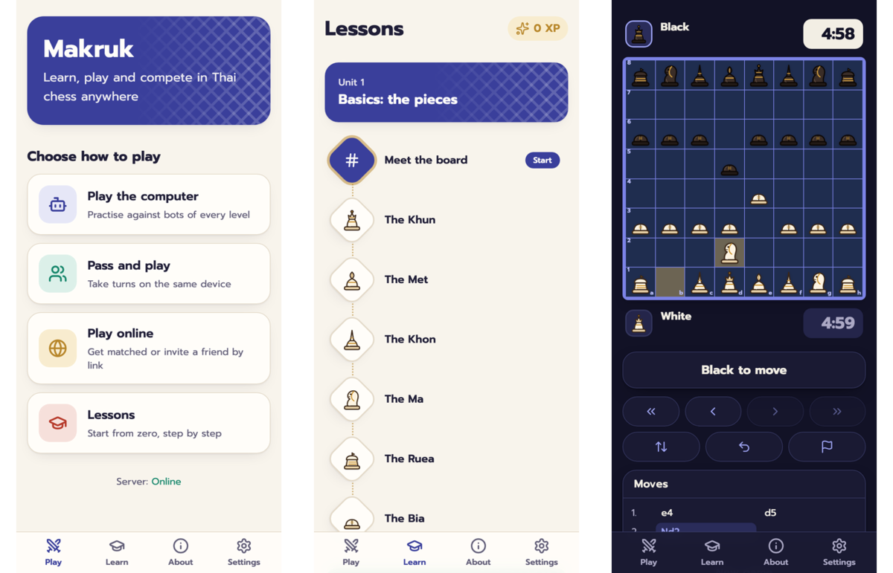

<div align="center">

# Chaturanga

**Traditional chess games from across Asia, free and open source, each in its own language.**

[](https://github.com/socheek-del/chaturanga/actions/workflows/ci.yml)
[](LICENSE)
[](CONTRIBUTING.md)

</div>

---

Chaturanga, the ancient Indian game, is the common ancestor of chess, Makruk, Sittuyin, Shogi and Xiangqi.
This repository builds its descendants as friendly web apps. Each game has its own site, look and
languages, so you can learn the rules from zero, practise against the computer and play friends online or
on one device.

## Games

| Game | | Status | Languages |
|---|---|---|---|
| [**หมากรุกไทย · Makruk**](apps/makruk/README.md) | Thai chess | ✅ Live: computer, online, pass-and-play, lessons | Thai, English |
| **စစ်တုရင် · Sittuyin** | Burmese chess | 🛠️ Rules engine done ([`packages/sittuyin`](packages/sittuyin/RULES.md)); app in progress | Burmese, English |

More games (Shogi, Xiangqi…) may follow. See the [platform plan](docs/PLATFORM.md).



## How the repository is organised

The games share engineering but not identity. Everything a player sees (rules, art, lessons, words, site)
belongs to one game. The shared packages hold what every game needs.

| Path | What it is |
|---|---|
| [`packages/rules-core`](packages/rules-core) | The `Variant` interface every rules engine implements, the shared 8×8 board and attacks, and a conformance test suite |
| [`packages/makruk`](packages/makruk) | Makruk rules, verified move-for-move against [Fairy-Stockfish](https://github.com/fairy-stockfish/Fairy-Stockfish) |
| [`packages/sittuyin`](packages/sittuyin) | Sittuyin rules (setup phase, promotion, counting), verified the same way |
| [`packages/ai`](packages/ai) | Computer opponents for Makruk |
| [`packages/protocol`](packages/protocol) | Message schemas shared by browsers and servers |
| [`apps/makruk`](apps/makruk) | The Makruk product: React PWA (`web`) and Cloudflare Worker (`worker`) |

## Run it locally

```bash
git clone https://github.com/socheek-del/chaturanga.git
cd chaturanga
nvm use          # Node 22
./init.sh        # install dependencies and run all checks
npm run dev      # Makruk web on http://localhost:5173, API + online play on :8787
```

## Contributing

Contributions of every size are welcome: bug reports, rule corrections, lessons, translations, art and code.
Start with [**CONTRIBUTING.md**](CONTRIBUTING.md), or
[open an issue](https://github.com/socheek-del/chaturanga/issues/new).

## License

[GPL-3.0-or-later](LICENSE) © Chaturanga contributors. The piece art, mascots and illustrations were made for
this project and are covered by the same license.
