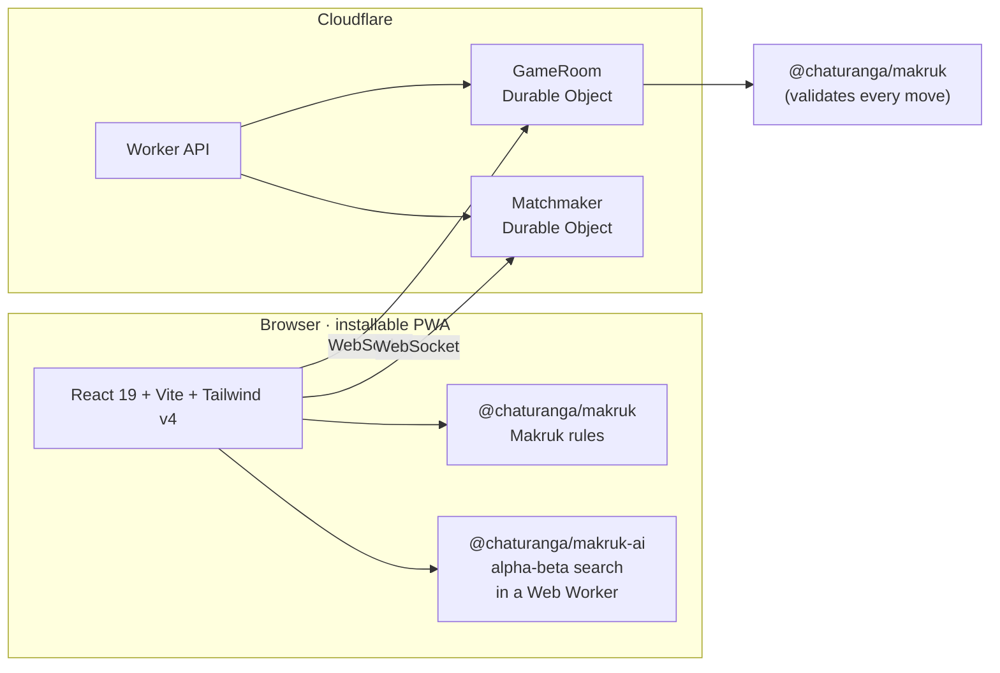

<div align="center">

**English** · [ภาษาไทย](README.th.md) · Part of [Chaturanga](../../README.md)


# หมากรุกไทย · Makruk

**Play Thai chess online — free, no sign-up, in Thai and English.**

[][play]

[](https://github.com/socheek-del/chaturanga/actions/workflows/ci.yml)
[](../../LICENSE)
[](../../CONTRIBUTING.md)
[][play]

[**Play**][play] · [Features](#features) · [What is Makruk?](#what-is-makruk) · [Run it locally](#run-it-locally) · [Contribute](#contributing)

</div>

---

Makruk (หมากรุกไทย) is the traditional chess of Thailand — older than the modern European game and still
played in parks and coffee shops across the country. This project brings it to any phone or computer: a
friendly place to **learn the rules from zero**, **practise against the computer**, and **play friends online**
or on one device. No ads, no accounts, and all the code is open source.

## Features

<table>
  <tr>
    <td width="50%" valign="top">
      <h3>🤖 Play the computer</h3>
      
      <p>Six bots from <b>Little Bia</b> to <b>Grand Khun</b>, each stronger than the last (checked by a
      20-game ladder on every level). Ask for a hint or take a move back while you learn.</p>
    </td>
    <td width="50%" valign="top">
      <h3>🌐 Play friends online</h3>
      
      <p>Quick match at <b>3+2 · 5+0 · 10+0</b>, or create a room and share the link, code or QR.
      Server-checked moves, clocks, draw offers, rematches and reconnecting after a dropped signal.</p>
    </td>
  </tr>
  <tr>
    <td width="50%" valign="top">
      <h3>📚 Learn from zero</h3>
      
      <p>Bite-sized, game-like lessons: the board, every piece, promotion, check and checkmate, and
      Makruk's <b>counting rules</b> — then a guided first game with a coach. Every lesson is open; start
      wherever you like.</p>
    </td>
    <td width="50%" valign="top">
      <h3>🎨 Make it yours</h3>
      
      <p>Six boards (teak, jade, gold lacquer, night market, minimal, high contrast), a carved classic
      piece set and a modern flat one, light and dark mode, sounds and haptics.</p>
    </td>
  </tr>
</table>

### Made for phones


- **Pass-and-play** on one device, with a board that rotates each turn or a tabletop view for sitting opposite.
- **Real Makruk rules** — Bia promotion, Sak Kradan and Sak Mak counting, repetition and insufficient
  material — verified move-for-move against [Fairy-Stockfish](https://github.com/fairy-stockfish/Fairy-Stockfish).
- **Chess clocks** with common presets (bullet to classical) or no clock at all.
- **Works offline** once installed — lessons, pass-and-play and the computer need no connection.
- **Never lose a game to a refresh** — games are saved as you play.
- **Thai first, English too** — switch any time; the choice is remembered on your device.

## What is Makruk?

Makruk is played on an 8×8 board. It shares its ancestry with international chess, but the pieces are
slower, the Bia (pawns) start further forward, and endgames come with a move limit.

| Piece | Thai | Moves | Closest chess piece |
|---|---|---|---|
| **Khun** | ขุน | One square in any direction | King |
| **Met** | เม็ด | One square diagonally | (Queen's square, much weaker) |
| **Khon** | โคน | One square diagonally, or one square straight forward | (Bishop's square) |
| **Ma** | ม้า | An L-shape, jumping over pieces | Knight |
| **Ruea** | เรือ | Any distance along a rank or file | Rook |
| **Bia** | เบี้ย | One square forward, captures one square diagonally forward; becomes a Met on the sixth rank | Pawn |

There is no castling, no double pawn step and no en passant. Checkmate wins; stalemate is a draw. When few
pieces are left, the **counting rules** give the stronger side a fixed number of moves to deliver mate —
the in-app lessons and [`RULES.md`](../../packages/makruk/RULES.md) explain them step by step.

## How it's built



| Package | What it does |
|---|---|
| [`packages/makruk`](../../packages/makruk) | Pure TypeScript rules engine — move generation, counting rules, FEN, perft; cross-checked against Fairy-Stockfish |
| [`packages/ai`](../../packages/ai) | Computer opponents: iterative deepening, quiescence, repetition-aware search, six tuned personas |
| [`packages/protocol`](../../packages/protocol) | Zod schemas shared by the browser and the server |
| [`apps/makruk/web`](web) | The React PWA: board, lessons, pass-and-play and the online client |
| [`apps/makruk/worker`](worker) | Cloudflare Worker with Durable Objects for game rooms, clocks and matchmaking |

The rules engine implements the shared `Variant` interface from
[`packages/rules-core`](../../packages/rules-core), the same one used by the other games in
[Chaturanga](../../README.md).

Every push runs lint, type checks and unit tests (including the Worker inside `workerd`); the UI is covered
by Playwright end-to-end tests, and a GitHub Actions workflow plays a 20-game ladder between every pair of
bot levels.

## Run it locally

```bash
git clone https://github.com/socheek-del/chaturanga.git
cd chaturanga
nvm use          # Node 22
./init.sh        # install dependencies and run all checks
npm run dev      # web on http://localhost:5173, API + online play on :8787
```

`npm run e2e` runs the Playwright suite against a local web app and Worker. The public site address lives in
one setting — see [Deploying to your own domain](../../CONTRIBUTING.md#deploying-to-your-own-domain).

## Contributing

Contributions of every size are welcome — bug reports, rule corrections, new lessons, translations, art and
code. Start with [**CONTRIBUTING.md**](../../CONTRIBUTING.md), or:

- 🐛 [Report a bug or suggest an idea](https://github.com/socheek-del/chaturanga/issues/new)
- 🇹🇭 Native Thai speaker? Help review the wording with [`docs/i18n-review.md`](docs/i18n-review.md)
- ♟️ Know Makruk well? Check the lessons and [`RULES.md`](../../packages/makruk/RULES.md)

## License

[GPL-3.0-or-later](../../LICENSE) © Chaturanga contributors. The piece art, mascot and illustrations were made for this
project and are covered by the same license.

<!-- The live site address is defined once here. -->
[play]: https://th-chess.beanroti.com
