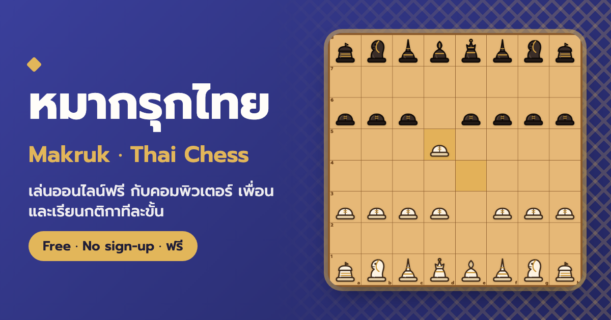
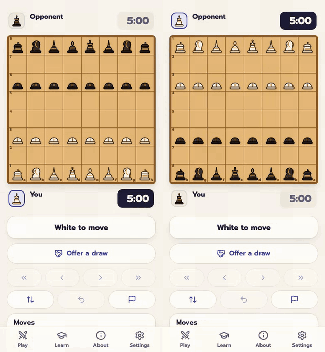
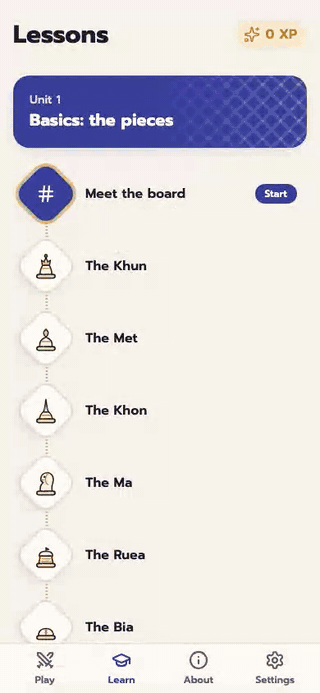
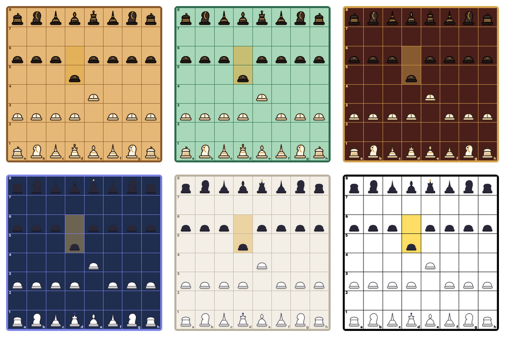
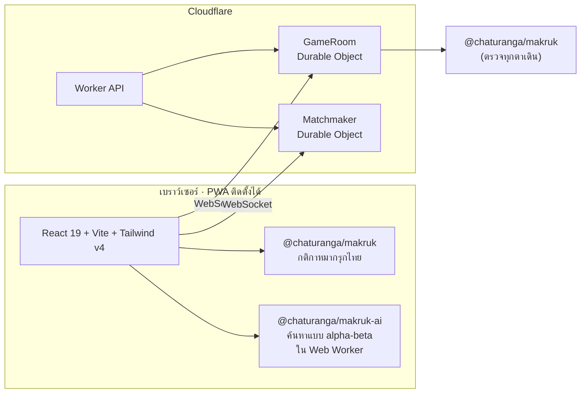

<div align="center">

[English](README.md) · **ภาษาไทย** · ส่วนหนึ่งของ [Chaturanga](../../README.md)



# หมากรุกไทย · Makruk

**เล่นหมากรุกไทยออนไลน์ ฟรี ไม่ต้องสมัครสมาชิก ใช้ได้ทั้งภาษาไทยและภาษาอังกฤษ**

[][play]

[](https://github.com/socheek-del/chaturanga/actions/workflows/ci.yml)
[](../../LICENSE)
[](../../CONTRIBUTING.md)
[][play]

[**เล่นเลย**][play] · [ฟีเจอร์](#ฟีเจอร์) · [หมากรุกไทยคืออะไร](#หมากรุกไทยคืออะไร) · [รันบนเครื่องตัวเอง](#รันบนเครื่องตัวเอง) · [ร่วมพัฒนา](#ร่วมพัฒนา)

</div>

---

หมากรุกไทยเป็นหมากกระดานดั้งเดิมของไทย มีประวัติยาวนานกว่าหมากรุกสากลแบบปัจจุบัน และยังเล่นกันทั่วไป
ตามสวนสาธารณะและร้านกาแฟทั่วประเทศ โปรเจกต์นี้นำหมากรุกไทยมาไว้บนมือถือและคอมพิวเตอร์ ให้ **เรียนกติกาได้ตั้งแต่ศูนย์**
**ฝึกกับคอมพิวเตอร์** และ **เล่นกับเพื่อนทางออนไลน์** หรือผลัดกันเล่นบนเครื่องเดียว ไม่มีโฆษณา ไม่ต้องมีบัญชี
และโค้ดทั้งหมดเป็นโอเพนซอร์ส

## ฟีเจอร์

<table>
  <tr>
    <td width="50%" valign="top">
      <h3>🤖 เล่นกับคอมพิวเตอร์</h3>
      
      <p>บอท 6 ระดับ ตั้งแต่ <b>เบี้ยน้อย</b> ถึง <b>ขุนพลใหญ่</b> แต่ละระดับเก่งกว่าระดับก่อนหน้า
      (ทดสอบด้วยการแข่ง 20 เกมทุกคู่ระดับ) ขอคำใบ้หรือถอนตาได้ระหว่างฝึก</p>
    </td>
    <td width="50%" valign="top">
      <h3>🌐 เล่นออนไลน์กับเพื่อน</h3>
      
      <p>จับคู่แบบเร็ว <b>3+2 · 5+0 · 10+0</b> หรือสร้างห้องแล้วส่งลิงก์ รหัสห้อง หรือ QR ให้เพื่อน
      เซิร์ฟเวอร์ตรวจทุกตาเดิน มีนาฬิกา ขอเสมอ ขอเล่นใหม่ และกลับเข้าเกมได้เมื่อสัญญาณหลุด</p>
    </td>
  </tr>
  <tr>
    <td width="50%" valign="top">
      <h3>📚 เรียนตั้งแต่ศูนย์</h3>
      
      <p>บทเรียนสั้น ๆ เรียนสนุกเหมือนเล่นเกม ทั้งกระดาน วิธีเดินหมากทุกตัว เบี้ยหงาย การรุกและรุกจน
      และ <b>กติกาการนับศักดิ์</b> ปิดท้ายด้วยเกมแรกพร้อมโค้ช ทุกบทเปิดให้เรียนได้ทันที เริ่มบทไหนก่อนก็ได้</p>
    </td>
    <td width="50%" valign="top">
      <h3>🎨 ปรับแต่งได้ตามใจ</h3>
      
      <p>กระดาน 6 แบบ (ไม้สัก หยก ลายรดน้ำ ตลาดนัดกลางคืน มินิมอล และคอนทราสต์สูง) หมากลายแกะสลัก
      และหมากแบบเรียบ โหมดสว่างและมืด เสียงประกอบ และการสั่น</p>
    </td>
  </tr>
</table>

### ออกแบบมาเพื่อมือถือ


- **เล่นสองคนเครื่องเดียว** กระดานหมุนตามตาเดิน หรือโหมดนั่งตรงข้ามกัน
- **กติกาหมากรุกไทยจริง** ทั้งเบี้ยหงาย การนับศักดิ์กระดานและนับศักดิ์หมาก ตำแหน่งซ้ำ และหมากไม่พอรุกจน
  ตรวจสอบทุกตาเดินเทียบกับ [Fairy-Stockfish](https://github.com/fairy-stockfish/Fairy-Stockfish)
- **นาฬิกาจับเวลา** มีค่าที่นิยมใช้ตั้งแต่บุลเล็ตถึงคลาสสิก หรือเล่นแบบไม่จับเวลา
- **เล่นออฟไลน์ได้** เมื่อติดตั้งเป็นแอป บทเรียน เล่นสองคน และเล่นกับคอมพิวเตอร์ไม่ต้องใช้อินเทอร์เน็ต
- **รีเฟรชหน้าแล้วเกมไม่หาย** ระบบบันทึกเกมไว้ตลอดการเล่น
- **ภาษาไทยเป็นหลัก มีภาษาอังกฤษด้วย** เปลี่ยนได้ทุกเมื่อ และเครื่องจะจำภาษาที่เลือกไว้

## หมากรุกไทยคืออะไร

หมากรุกไทยเล่นบนกระดาน 8×8 มีรากเดียวกับหมากรุกสากล แต่หมากเดินช้ากว่า เบี้ยตั้งอยู่ล้ำหน้ากว่า
และช่วงท้ายเกมมีกติกาจำกัดจำนวนตาเดิน

| หมาก | ชื่ออังกฤษ | วิธีเดิน | เทียบกับหมากรุกสากล |
|---|---|---|---|
| **ขุน** | Khun | เดินได้ 1 ช่องทุกทิศทาง | King |
| **เม็ด** | Met | เดินทแยงได้ 1 ช่อง | (ตำแหน่งควีน แต่อ่อนกว่ามาก) |
| **โคน** | Khon | เดินทแยง 1 ช่อง หรือเดินตรงไปข้างหน้า 1 ช่อง | (ตำแหน่งบิชอป) |
| **ม้า** | Ma | เดินเป็นรูปตัว L กระโดดข้ามหมากได้ | Knight |
| **เรือ** | Ruea | เดินตรงตามแถวหรือตามคอลัมน์กี่ช่องก็ได้ | Rook |
| **เบี้ย** | Bia | เดินหน้า 1 ช่อง กินทแยงไปข้างหน้า 1 ช่อง และหงายเป็นเม็ดเมื่อถึงแถวที่หก | Pawn |

หมากรุกไทยไม่มีการเข้าป้อม ไม่มีเบี้ยเดินสองช่อง และไม่มีการกินผ่าน รุกจนคือชนะ อับคือเสมอ
เมื่อหมากเหลือน้อย **กติกาการนับศักดิ์** จะให้ฝ่ายที่ได้เปรียบรุกจนให้ได้ภายในจำนวนตาที่กำหนด
ดูคำอธิบายทีละขั้นได้ในบทเรียนในแอปและใน [`RULES.md`](../../packages/makruk/RULES.md)

## สร้างด้วยอะไร



| แพ็กเกจ | หน้าที่ |
|---|---|
| [`packages/makruk`](../../packages/makruk) | เอนจินกติกาหมากรุกไทยด้วย TypeScript ล้วน สร้างตาเดิน นับศักดิ์ FEN และ perft ตรวจเทียบกับ Fairy-Stockfish |
| [`packages/ai`](../../packages/ai) | ผู้เล่นคอมพิวเตอร์ ค้นหาแบบ iterative deepening และ quiescence หลีกเลี่ยงตำแหน่งซ้ำ พร้อมบอท 6 บุคลิก |
| [`packages/protocol`](../../packages/protocol) | สคีมา Zod ที่ใช้ร่วมกันระหว่างเบราว์เซอร์และเซิร์ฟเวอร์ |
| [`apps/makruk/web`](web) | แอป React PWA ทั้งกระดาน บทเรียน เล่นสองคน และหน้าเล่นออนไลน์ |
| [`apps/makruk/worker`](worker) | Cloudflare Worker และ Durable Objects สำหรับห้องเกม นาฬิกา และระบบจับคู่ |

เอนจินกติกาใช้อินเทอร์เฟซ `Variant` ร่วมกันจาก [`packages/rules-core`](../../packages/rules-core)
แบบเดียวกับเกมอื่น ๆ ใน [Chaturanga](../../README.md)

ทุกครั้งที่ push ระบบจะตรวจ lint ชนิดข้อมูล และ unit test (รวมถึงทดสอบ Worker ใน `workerd`)
หน้าแอปทดสอบด้วย Playwright แบบ end-to-end และมีเวิร์กโฟลว์บน GitHub Actions ให้บอททุกคู่ระดับแข่งกัน 20 เกม

## รันบนเครื่องตัวเอง

```bash
git clone https://github.com/socheek-del/chaturanga.git
cd chaturanga
nvm use          # Node 22
./init.sh        # ติดตั้งแพ็กเกจและรันการตรวจทั้งหมด
npm run dev      # เว็บที่ http://localhost:5173 ส่วน API และเล่นออนไลน์ที่ :8787
```

`npm run e2e` รันชุดทดสอบ Playwright กับเว็บและ Worker บนเครื่อง ที่อยู่เว็บไซต์กำหนดไว้ที่เดียว
ดู [การ deploy บนโดเมนของคุณเอง](../../CONTRIBUTING.md#deploying-to-your-own-domain)

## ร่วมพัฒนา

ยินดีรับทุกความช่วยเหลือ ไม่ว่าจะเล็กหรือใหญ่ ทั้งรายงานบั๊ก แก้กติกาให้ถูกต้อง เพิ่มบทเรียน แปลภาษา วาดภาพ และเขียนโค้ด
เริ่มจาก [**CONTRIBUTING.md**](../../CONTRIBUTING.md) หรือ

- 🐛 [รายงานบั๊กหรือเสนอไอเดีย](https://github.com/socheek-del/chaturanga/issues/new)
- 🇹🇭 คนไทยช่วยตรวจถ้อยคำภาษาไทยได้ที่ [`docs/i18n-review.md`](docs/i18n-review.md)
- ♟️ เล่นหมากรุกไทยเก่ง ช่วยตรวจบทเรียนและ [`RULES.md`](../../packages/makruk/RULES.md)

## สัญญาอนุญาต

[GPL-3.0-or-later](../../LICENSE) © ผู้ร่วมพัฒนา Chaturanga ภาพหมาก มาสคอต และภาพประกอบทั้งหมดสร้างขึ้นสำหรับโปรเจกต์นี้
และใช้สัญญาอนุญาตเดียวกัน

<!-- ที่อยู่เว็บไซต์กำหนดไว้ที่นี่ที่เดียว -->
[play]: https://th-chess.beanroti.com
