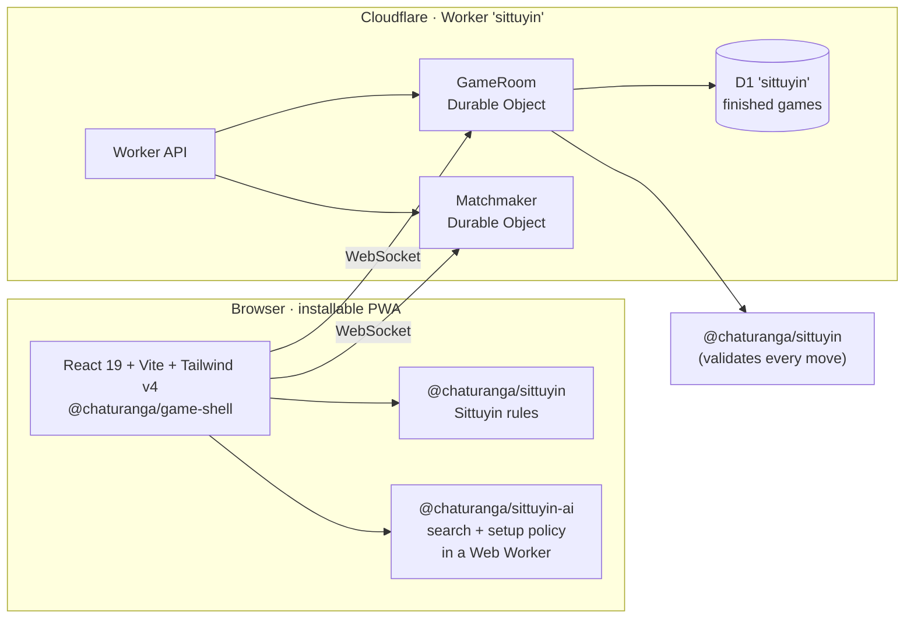

<div align="center">

**English** · [မြန်မာ](README.my.md) · Part of [Chaturanga](../../README.md)


# စစ်တုရင် · Sittuyin

**Play Burmese chess online — free, no sign-up, in Burmese and English.**

[][play]

[](https://github.com/socheek-del/chaturanga/actions/workflows/ci.yml)
[](../../LICENSE)
[](../../CONTRIBUTING.md)
[][play]

[**Play**][play] · [Features](#features) · [What is Sittuyin?](#what-is-sittuyin) · [Run it locally](#run-it-locally) · [Contribute](#contributing)

</div>

---

Sittuyin (စစ်တုရင်) is the traditional chess of Myanmar. Its most striking rule comes before the first move:
each player **arranges their own army** behind a staircase of pawns, so no two games open the same way.
This project brings the game to any phone or computer — **learn the rules from zero**, **practise against the
computer**, and **play friends online** or on one device. No ads, no accounts, and all the code is open source.

## Features

<table>
  <tr>
    <td width="50%" valign="top">
      <h3>🤖 Play the computer</h3>
      
      <p>Six opponents named after the pieces, from <b>Ne</b> to <b>Min-gyi</b>, each stronger than the last
      (checked by a 20-game ladder on every level). <b>Auto-arrange</b> sets up your army; ask for a hint or
      take a move back while you learn.</p>
    </td>
    <td width="50%" valign="top">
      <h3>🌐 Play friends online</h3>
      
      <p>Quick match at <b>3+2 · 5+0 · 10+0</b>, or create a room and share the code, link or QR. The
      server checks every placement and move; clocks only start once both armies are set up.</p>
    </td>
  </tr>
  <tr>
    <td width="50%" valign="top">
      <h3>📚 Learn from zero</h3>
      
      <p>Twelve short lessons: the board, <b>setting up your army</b>, every piece, promotion, check,
      checkmate and the count. Every answer is checked by the rules engine, and every lesson is open —
      start wherever you like.</p>
    </td>
    <td width="50%" valign="top">
      <h3>🦚 Its own look</h3>
      
      <p>Peacock teal and Bagan lacquer: an in-house piece set, five boards with the two promotion
      diagonals drawn in brass, light and dark mode, and Noto Sans Myanmar throughout.</p>
    </td>
  </tr>
</table>

- **Pass-and-play** on one device, from the setup of both armies to checkmate.
- **Real Sittuyin rules** — the setup phase, promotion on the diagonals, the ASEAN count and the 50-move
  rule — verified move-for-move against [Fairy-Stockfish](https://github.com/fairy-stockfish/Fairy-Stockfish).
- **Chess clocks** with common presets or no clock at all; they wait until every piece is placed.
- **Works offline** once installed — lessons, pass-and-play and the computer need no connection.
- **Never lose a game to a refresh** — games, even a half-finished setup, are saved as you play.
- **Burmese first (Unicode), English too** — switch any time; the choice is remembered on your device.

## What is Sittuyin?

Sittuyin is played on an 8×8 board. At the start only the eight **Ne** of each side stand on the board, in a
staircase: for White, a3–d3 and e4–h4. The other eight pieces start in hand, and the players place them one at
a time, White first, on empty squares of their own side. A **Yahhta** may only go on the back rank.

| Piece | Burmese | Moves | Closest chess piece |
|---|---|---|---|
| **Min-gyi** | မင်းကြီး | One square in any direction | King |
| **Sit-ke** | စစ်ကဲ | One square diagonally | (Queen's square, much weaker) |
| **Sin** | ဆင် | One square diagonally, or one square straight forward | (Bishop's square) |
| **Myin** | မြင်း | An L-shape, jumping over pieces | Knight |
| **Yahhta** | ရထား | Any distance along a rank or file | Rook |
| **Ne** | နေ | One square forward, captures one square diagonally forward | Pawn |

A Ne **promotes to a Sit-ke** as a move of its own, from the two long diagonals in the opponent's half (or
from anywhere, if it is the last Ne) — and only while that side has no Sit-ke. Checkmate wins; stalemate is a
draw. When one side is down to a bare Min-gyi, the stronger side must mate within a limit set by its best
piece: 16 moves with a Yahhta, 44 with a Sin, 64 with a Myin. The in-app lessons and
[`RULES.md`](../../packages/sittuyin/RULES.md) explain it step by step.

## How it's built



| Package | What it does |
|---|---|
| [`packages/sittuyin`](../../packages/sittuyin) | Pure TypeScript rules engine — setup phase, promotion, counting, FEN, perft; cross-checked against Fairy-Stockfish |
| [`packages/sittuyin-ai`](../../packages/sittuyin-ai) | Six computer opponents and the traditional-arrangement setup policy, on the shared [`ai-core`](../../packages/ai-core) search |
| [`packages/game-shell`](../../packages/game-shell) | The game screen, lesson player and online client shared by every Chaturanga site |
| [`packages/server-kit`](../../packages/server-kit) | Room logic and Durable Objects shared by every Chaturanga Worker |
| [`apps/sittuyin/web`](web) | The React PWA: board and hand trays, lessons, pass-and-play, the computer and the online client |
| [`apps/sittuyin/worker`](worker) | Cloudflare Worker with its own Durable Objects and D1 database |

Every push runs lint, type checks and unit tests (including the Worker inside `workerd`); the UI is covered
by Playwright end-to-end tests, and a GitHub Actions workflow plays a 20-game ladder between every pair of
bot levels.

## Run it locally

```bash
git clone https://github.com/socheek-del/chaturanga.git
cd chaturanga
nvm use                  # Node 22
./init.sh                # install dependencies and run all checks
npm run dev:sittuyin     # web on http://localhost:5174, API + online play on :8788
```

`npm run e2e -w apps/sittuyin/web` runs the Playwright suite against a local web app and Worker. The public
site address lives in one setting: `apps/sittuyin/web/site.config.ts`.

## Contributing

Contributions of every size are welcome — bug reports, rule corrections, new lessons, translations, art and
code. Start with [**CONTRIBUTING.md**](../../CONTRIBUTING.md), or:

- 🐛 [Report a bug or suggest an idea](https://github.com/socheek-del/chaturanga/issues/new)
- 🇲🇲 Native Burmese speaker? Help review the wording with [`docs/i18n-review.md`](docs/i18n-review.md)
- ♟️ Know Sittuyin well? Check the lessons and [`RULES.md`](../../packages/sittuyin/RULES.md)

## License

[GPL-3.0-or-later](../../LICENSE) © Chaturanga contributors. The piece art and illustrations were made for this
project and are covered by the same license.

<!-- The live site address is defined once here. -->
[play]: https://my-chess.beanroti.com
