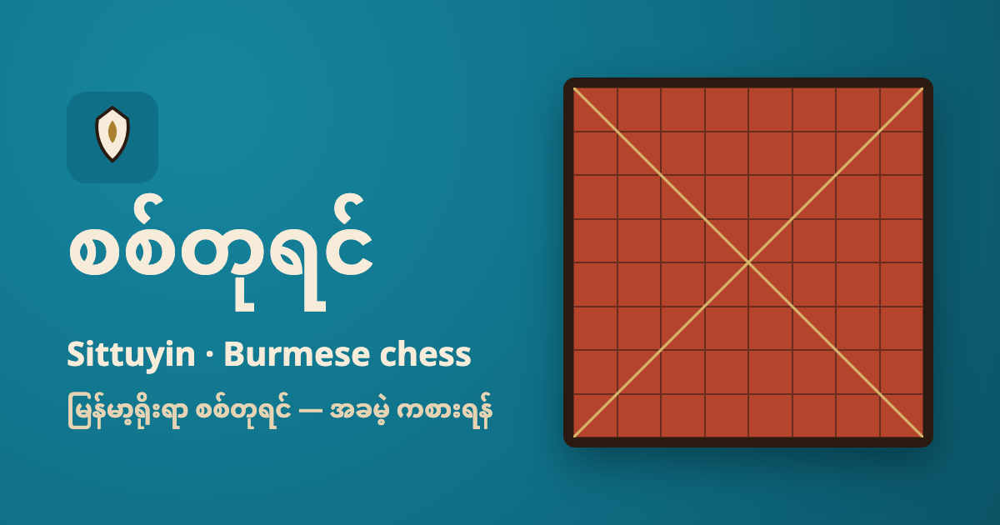
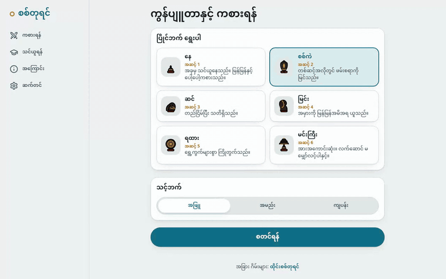
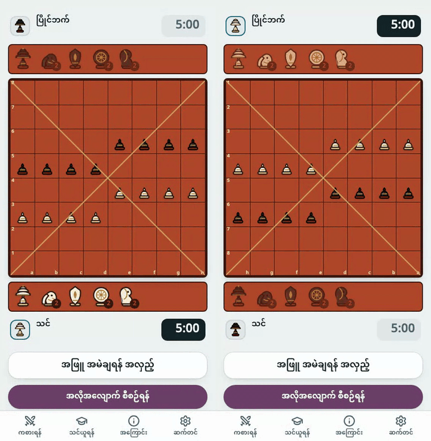
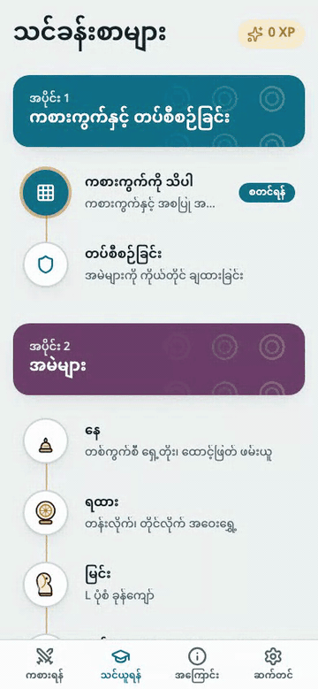
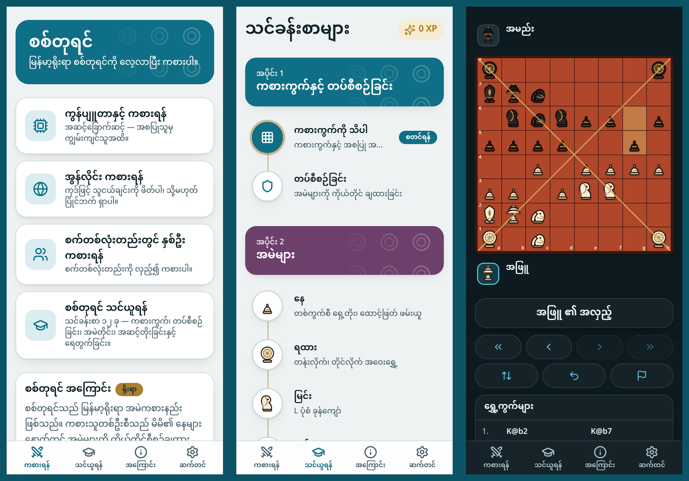

<div align="center">

[English](README.md) · **မြန်မာ** · [Chaturanga](../../README.md) ၏ အစိတ်အပိုင်း



# စစ်တုရင် · Sittuyin

**မြန်မာ့ရိုးရာ စစ်တုရင်ကို အွန်လိုင်းတွင် အခမဲ့ ကစားပါ — အကောင့်မလို၊ မြန်မာနှင့် အင်္ဂလိပ် ဘာသာ။**

[][play]

[](https://github.com/socheek-del/chaturanga/actions/workflows/ci.yml)
[](../../LICENSE)
[](../../CONTRIBUTING.md)

[**ကစားရန်**][play] · [လုပ်ဆောင်ချက်များ](#လုပ်ဆောင်ချက်များ) · [စစ်တုရင် ဆိုသည်မှာ](#စစ်တုရင်-ဆိုသည်မှာ) · [ကိုယ့်စက်တွင် ဖွင့်ရန်](#ကိုယ့်စက်တွင်-ဖွင့်ရန်) · [ကူညီပံ့ပိုးရန်](#ကူညီပံ့ပိုးရန်)

</div>

---

စစ်တုရင်သည် မြန်မာ့ရိုးရာ အမဲကစားနည်း ဖြစ်သည်။ ပထမ ရွှေ့ကွက်မတိုင်မီကပင် ထူးခြားသည် — ကစားသူတစ်ဦးစီသည်
လှေကားထစ်ပုံ တန်းစီထားသော နေများနောက်တွင် **မိမိ၏ တပ်ကို ကိုယ်တိုင် စီစဉ်** ရသဖြင့် ပွဲတိုင်း အစချင်း မတူပါ။ ဤ
ပရောဂျက်သည် ဖုန်း သို့မဟုတ် ကွန်ပျူတာ မည်သည့်စက်တွင်မဆို **စည်းမျဉ်းကို အစမှ လေ့လာ**၊ **ကွန်ပျူတာနှင့် လေ့ကျင့်**၊
**သူငယ်ချင်းနှင့် အွန်လိုင်း** သို့မဟုတ် စက်တစ်လုံးတည်းတွင် ကစားနိုင်စေသည်။ ကြော်ငြာမပါ၊ အကောင့်မလို၊ ကုဒ်အားလုံး
ပွင့်လင်း အရင်းအမြစ် ဖြစ်သည်။

## လုပ်ဆောင်ချက်များ

<table>
  <tr>
    <td width="50%" valign="top">
      <h3>🤖 ကွန်ပျူတာနှင့် ကစားရန်</h3>
      
      <p>အမဲအမည်ဖြင့် ပြိုင်ဘက် ခြောက်ဦး — <b>နေ</b> မှ <b>မင်းကြီး</b> အထိ၊ တစ်ဆင့်ထက် တစ်ဆင့် အားကောင်းသည်
      (အဆင့်တိုင်းကို ပွဲ ၂၀ ဖြင့် စစ်ဆေးထားသည်)။ <b>အလိုအလျောက် စီစဉ်ရန်</b> က တပ်ကို စီပေးသည်၊
      အကြံပြုချက် တောင်းနိုင်ပြီး ရွှေ့ကွက်ကို ပြန်ရုပ်သိမ်းနိုင်သည်။</p>
    </td>
    <td width="50%" valign="top">
      <h3>🌐 သူငယ်ချင်းနှင့် အွန်လိုင်း</h3>
      
      <p><b>3+2 · 5+0 · 10+0</b> အမြန်ပွဲ၊ သို့မဟုတ် အခန်းဖန်တီးပြီး ကုဒ်၊ လင့်ခ် သို့မဟုတ် QR ကို ပို့ပါ။
      ဆာဗာက အမဲချခြင်းနှင့် ရွှေ့ကွက်တိုင်းကို စစ်ဆေးသည်၊ နှစ်ဖက်စလုံး တပ်စီပြီးမှ နာရီ စတင်သည်။</p>
    </td>
  </tr>
  <tr>
    <td width="50%" valign="top">
      <h3>📚 အစမှ လေ့လာရန်</h3>
      
      <p>တိုတောင်းသော သင်ခန်းစာ ၁၂ ခု — ကစားကွက်၊ <b>တပ်စီစဉ်ခြင်း</b>၊ အမဲတိုင်း၊ အဆင့်တိုးခြင်း၊ ရှင်တိုက်၊
      ရှင်သေနှင့် ရေတွက်ခြင်း။ အဖြေတိုင်းကို စည်းမျဉ်း အင်ဂျင်က စစ်ဆေးသည်၊ သင်ခန်းစာအားလုံး ဖွင့်ထားသည်။</p>
    </td>
    <td width="50%" valign="top">
      <h3>🦚 ကိုယ်ပိုင် အသွင်အပြင်</h3>
      
      <p>ဒေါင်းအရောင်နှင့် ပုဂံ ယွန်းထည် — ကိုယ်ပိုင် အမဲပုံစံ၊ အဆင့်တိုး ထောင့်ဖြတ်မျဉ်းများ ပါသော ကစားကွက် ငါးမျိုး၊
      အလင်းနှင့် အမှောင် မုဒ်၊ Noto Sans Myanmar စာလုံး။</p>
    </td>
  </tr>
</table>

- **စက်တစ်လုံးတည်းတွင် နှစ်ဦးကစား** — တပ်စီစဉ်ခြင်းမှ ရှင်သေအထိ။
- **စစ်မှန်သော စစ်တုရင် စည်းမျဉ်း** — တပ်စီစဉ်ချိန်၊ ထောင့်ဖြတ်မျဉ်းပေါ် အဆင့်တိုးခြင်း၊ အာဆီယံ ရေတွက်နည်းနှင့်
  ရွှေ့ကွက် ၅၀ စည်းမျဉ်း — [Fairy-Stockfish](https://github.com/fairy-stockfish/Fairy-Stockfish) နှင့် ရွှေ့ကွက်တိုင်း တိုက်စစ်ထားသည်။
- **နာရီ** — အမဲအားလုံး ချပြီးမှ စတင်သည်။
- **အင်တာနက်မရှိလည်း ကစားနိုင်** — ထည့်သွင်းပြီးပါက သင်ခန်းစာ၊ နှစ်ဦးကစားနှင့် ကွန်ပျူတာ ပွဲများ။
- **စာမျက်နှာ ပြန်ဖွင့်လည်း ပွဲ မပျောက်** — တပ်စီစဉ်နေဆဲ ပွဲပါ သိမ်းထားသည်။
- **မြန်မာစာ (ယူနီကုဒ်) ဦးစားပေး၊ အင်္ဂလိပ်လည်း ရ** — ရွေးချယ်မှုကို စက်တွင် မှတ်ထားသည်။

## စစ်တုရင် ဆိုသည်မှာ

စစ်တုရင်ကို ၈×၈ ကစားကွက်ပေါ်တွင် ကစားသည်။ ပွဲစချိန်တွင် ဘက်တစ်ဖက်စီ၏ **နေ** ရှစ်ခုသာ လှေကားထစ်ပုံ ရှိသည် —
အဖြူဘက်တွင် a3–d3 နှင့် e4–h4။ ကျန်အမဲ ရှစ်ခုကို လက်ထဲမှ အဖြူက အရင်စ၍ အလှည့်ကျ တစ်ခုစီ မိမိဘက်ခြမ်းရှိ
ဗလာအကွက်ပေါ် ချရသည်။ **ရထား** ကို နောက်ဆုံးတန်းတွင်သာ ချနိုင်သည်။

| အမဲ | ရွှေ့ပုံ |
|---|---|
| **မင်းကြီး** | ဘက်တိုင်းသို့ တစ်ကွက် |
| **စစ်ကဲ** | ထောင့်ဖြတ် တစ်ကွက် |
| **ဆင်** | ထောင့်ဖြတ် တစ်ကွက် သို့မဟုတ် ရှေ့တည့်တည့် တစ်ကွက် |
| **မြင်း** | L ပုံစံ၊ အမဲများကို ကျော်ခုန်သည် |
| **ရထား** | တန်းလိုက် သို့မဟုတ် တိုင်လိုက် အကွက်မည်မျှမဆို |
| **နေ** | ရှေ့သို့ တစ်ကွက်၊ ရှေ့ထောင့်ဖြတ် တစ်ကွက်ဖြင့် ဖမ်းသည် |

နေသည် ပြိုင်ဘက်ခြမ်းရှိ ထောင့်ဖြတ်မျဉ်းကြီး နှစ်ခုပေါ်မှ (နောက်ဆုံးနေ ဖြစ်ပါက မည်သည့်အကွက်မှမဆို) သီးခြား
ရွှေ့ကွက်တစ်ခုအဖြစ် **စစ်ကဲ အဖြစ် အဆင့်တိုး** နိုင်သည် — ထိုဘက်တွင် စစ်ကဲ မရှိမှသာ။ ရှင်သေလျှင် နိုင်သည်၊ ရွှေ့စရာ
မရှိလျှင် သရေ ဖြစ်သည်။ တစ်ဖက်တွင် မင်းကြီး တစ်ပါးတည်း ကျန်သောအခါ အားသာသူသည် အကောင်းဆုံးအမဲအလိုက်
ကန့်သတ်ချက်အတွင်း ရှင်သေအောင် လုပ်ရသည် — ရထားဖြင့် ရွှေ့ကွက် ၁၆၊ ဆင်ဖြင့် ၄၄၊ မြင်းဖြင့် ၆၄။ အသေးစိတ်ကို
ဝဘ်ဆိုက်ရှိ သင်ခန်းစာများနှင့် [`RULES.md`](../../packages/sittuyin/RULES.md) (အင်္ဂလိပ်) တွင် ကြည့်ပါ။

## တည်ဆောက်ပုံ

React 19 + Vite + Tailwind v4 ဖြင့် ရေးထားသော PWA တစ်ခု ဖြစ်ပြီး စည်းမျဉ်း အင်ဂျင်
[`packages/sittuyin`](../../packages/sittuyin)၊ ကွန်ပျူတာ ပြိုင်ဘက် [`packages/sittuyin-ai`](../../packages/sittuyin-ai)
နှင့် Cloudflare Worker ([`apps/sittuyin/worker`](worker)) ကို အသုံးပြုသည်။ အွန်လိုင်းပွဲ၏ ရွှေ့ကွက်တိုင်းကို ဆာဗာက
စည်းမျဉ်း အင်ဂျင်ဖြင့် စစ်ဆေးသည်။ အသေးစိတ်ကို [English README](README.md#how-its-built) တွင် ကြည့်ပါ။

## ကိုယ့်စက်တွင် ဖွင့်ရန်

```bash
git clone https://github.com/socheek-del/chaturanga.git
cd chaturanga
nvm use                  # Node 22
./init.sh                # dependency ထည့်သွင်းပြီး စစ်ဆေးမှုအားလုံး လုပ်ဆောင်သည်
npm run dev:sittuyin     # ဝဘ်: http://localhost:5174 ၊ API နှင့် အွန်လိုင်း: :8788
```

## ကူညီပံ့ပိုးရန်

ချို့ယွင်းချက် တင်ပြခြင်း၊ စည်းမျဉ်း ပြင်ဆင်ခြင်း၊ သင်ခန်းစာ၊ ဘာသာပြန်၊ ပုံနှင့် ကုဒ် — အရွယ်အစားမရွေး ကြိုဆိုပါသည်။
[**CONTRIBUTING.md**](../../CONTRIBUTING.md) မှ စတင်ပါ၊ သို့မဟုတ် —

- 🐛 [ချို့ယွင်းချက် တင်ပြရန် သို့မဟုတ် အကြံပေးရန်](https://github.com/socheek-del/chaturanga/issues/new)
- 🇲🇲 မြန်မာစာ မိခင်ဘာသာ ပြောသူလား — [`docs/i18n-review.md`](docs/i18n-review.md) ဖြင့် စကားလုံးများကို စစ်ဆေးပေးပါ
- ♟️ စစ်တုရင် ကျွမ်းကျင်သူလား — သင်ခန်းစာများနှင့် [`RULES.md`](../../packages/sittuyin/RULES.md) ကို စစ်ဆေးပေးပါ

## လိုင်စင်

[GPL-3.0-or-later](../../LICENSE) © Chaturanga contributors။ အမဲပုံများနှင့် သရုပ်ဖော်ပုံများကို ဤပရောဂျက်အတွက်
ဆွဲထားပြီး တူညီသော လိုင်စင် အောက်တွင် ရှိသည်။

<!-- The live site address is defined once here. -->
[play]: https://my-chess.beanroti.com
